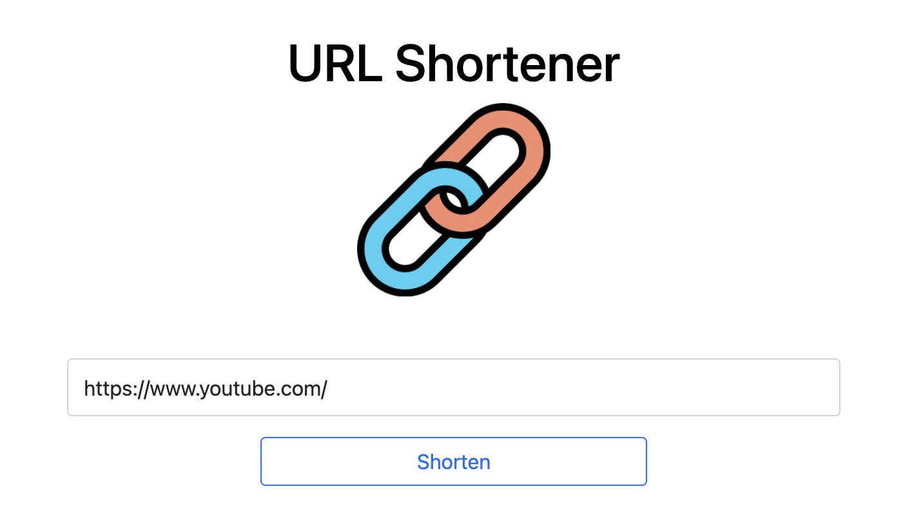

# 短網址產生器



## 介紹

可以將網址縮短，由伺服器產生一組短的網址，以代替原來可能較長的網址，並讓使用者可以在其他地方任意使用。

### 功能

- 使用者可以在表單輸入原始網址，送出表單之後，畫面會回傳格式化後的短網址。
- 在伺服器啟動期間，使用者可以在瀏覽器的網址列，輸入你提供的短網址。

## 開始使用

1. 請先確認有安裝 node.js 與 npm
2. 將專案 clone 到本地
3. 在本地開啟之後，透過終端機進入資料夾，輸入：

   ```bash
   npm install
   ```

4. 安裝完畢後，繼續輸入：

   ```bash
   npm run start
   ```

5. 若看見此行訊息則代表順利運行，打開瀏覽器進入到以下網址

   ```bash
   Listening on http://localhost:3000
   ```

6. 若欲暫停使用

   ```bash
   ctrl + c
   ```

## 開發工具

- node.js 14.18.0
- express 4.17.3
- express-Handlebars 4.0.2
- bootstrap 5.1.3

- mongoDB 資料庫
- mongoose 6.2.3
- method-override 3.0.0